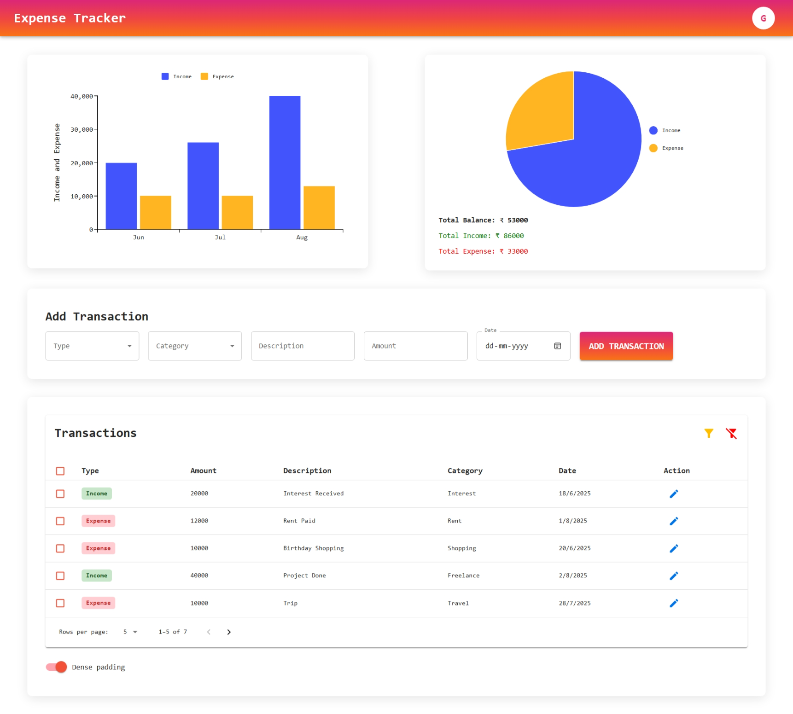

# 📊 Expense Tracker Application

**Machine Test Project**  
A full-stack Expense Tracker app that allows users to **add**, **view**, **filter**, and **manage** their income and expenses in a visually intuitive way.

## 🧾 Objective
Build a user-friendly application with a RESTful backend and dynamic frontend UI to track and analyze financial transactions.

## 🚀 Features

### ✅ Backend (Node.js + Express + MongoDB)
- RESTful API for transaction management
- JWT-based user authentication
- CRUD operations for transactions
- Filter transactions by:
  - Type (income/expense)
  - Category (e.g., salary, groceries)
  - Date
- Input validation and error handling

### ✅ Frontend (React + MUI + Redux Toolkit)
- Dashboard showing all transactions
- Summary view of income and expenses
- Filter transactions by type, category and date
- Add/edit/delete transactions
- Visualizations using bar/pie charts
- Loading indicators and form validations

## 🛠️ Technologies Used

### Backend:
- Node.js
- Express
- MongoDB with Mongoose
- JWT for authentication
- Dotenv for environment config
- Morgan for logging

### Frontend:
- React
- Material UI (MUI)
- Redux Toolkit
- Axios
- Chart.js / Recharts (for charts)

## ⚙️ Backend Setup Instructions
- cd Expense-Tracker-Application/backend
- npm install
- Create a .env file in the backend directory and add
    - PORT=8000
    - CONNECTION=your_mongodb_connection_string
    - JWT_TOKEN=your_jwt_secret
- Run the Server
    - For development: npm run dev
    - For production: npm start

## 💻 Frontend Setup Instructions
- cd Expense-Tracker-Application/frontend
- npm install
- npm run dev

## 🖼️ Screenshots

### Dashboard View

